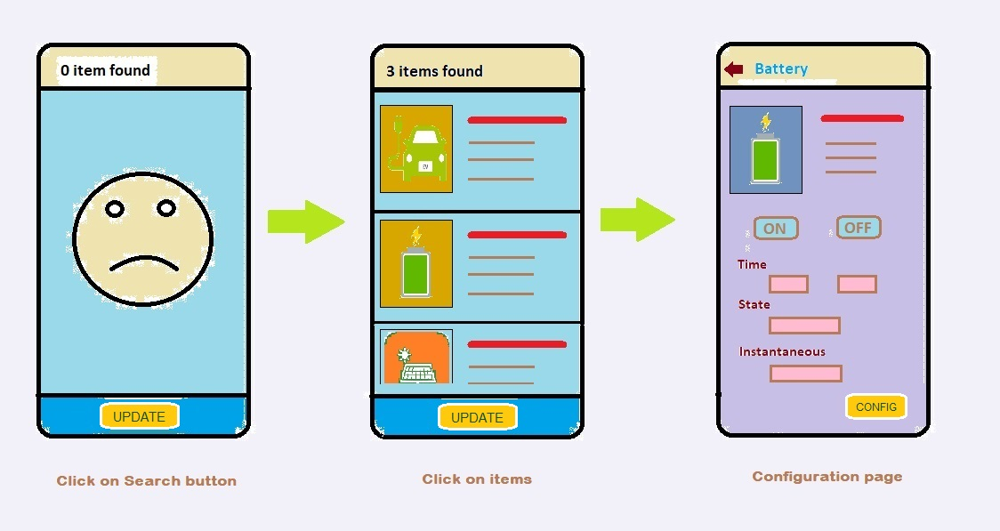

#Giới thiệu
[TOCM]
# HEMS Mobile
Vào khoảng 2019-2020, mình đã qua Nhật làm việc 1 thời gian
Ở đây thì mình làm việc trong dự án HEMS.

###HEMS
**Home Energy Management System**
Đại khái là quản lý điện đóm trong nhà.
Ấy tên là thế thôi chứ thực chất nó có thể quản lý tất tần tật các thiết bị điện, cả kể** điều khiển, hẹn giờ, bật tắt**...
Nói chung là hỗ trợ cho [**IoT**](https://en.wikipedia.org/wiki/Internet_of_things "**IoT**") khá là mạnh, nếu ở Nhật mua vài thiết bị về là có thể làm cái **Smart House** dễ như trở bàn tay.
Ban đầu thì mình được anh Yamashita (boss của mình) hướng dẫn viết bằng **C**.
Mình cũng khá đam mê **C** nên làm quen khá nhanh, tuy nhiên viết bằng **C** khá là vất vả, vì các thiết bị giao tiếp dưới tầng **UDP** và tuân thủ theo [**ECHONET Lite**](https://echonet.jp/english/ "**Echonet Lite**") nên rất nhiều thông tin và phức tạp.
Sau đó mình được giới thiệu thư viện [**OpenECHO**](https://github.com/SonyCSL/OpenECHO#openecho "**OpenECHO**") của các anh Sony, viết sẵn bằng Java thì nhàn hơn.

